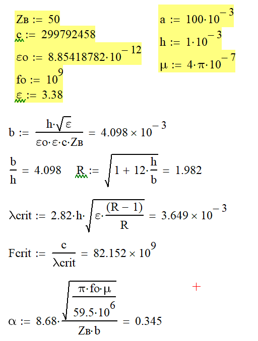

# Моделирование и расчет полосковой линии (Microstrip Line / Coupler)

Проект посвящен высокочастотному моделированию, расчету и исследованию основных параметров полосковой линии передачи в среде CST Studio Suite.

---

## Расчеты параметров

Ниже представлены аналитические расчеты геометрических и электрических характеристик линии:

### Исходные данные и результаты расчета:
* Волновое сопротивление ($Z_B$): 50 Ом
* Относительная диэлектрическая проницаемость подложки ($\varepsilon$): 3.38
* Толщина подложки ($h$): 1 мм ($1 \cdot 10^{-3}$ м)
* Ширина проводника ($b$): $4.098$ мм
* Критическая частота ($F_{crit}$): $82.15$ ГГц
* Коэффициент затухания ($\alpha$): $0.345$ дБ/м

---

## 3D Модель и геометрия

Ниже представлена геометрия исследуемой конструкции полосковой линии:

### Пояснение к модели:
* Подложка и проводники: Конструкция представляет собой связанную полосковую структуру на диэлектрической подложке с экранной заземляющей поверхностью.
* Порты возбуждения: На модели заданы порты дискретного возбуждения (Discrete Ports) для подачи ВЧ-сигнала и съема характеристик отражения/прохождения.

---

## Результаты расчетов и аналитика

Моделирование и анализ параметров проводились в диапазоне частот 0.8 – 1.2 ГГц. 

Центральная рабочая частота идеального согласования структуры составила $f_0 = 1.015$ ГГц.

### Итоговая таблица ключевых параметров (на 1.015 ГГц):

| Параметр | Обозначение | Значение | Физический смысл |
| :--- | :---: | :---: | :--- |
| Коэффициент отражения | S11 | -28.86 dB | Меньше -20 dB указывает на минимальные потери на отражение и отличное согласование. |
| КСВН | VSWR1 | 1.086 | Значение близко к идеальной 1.0 (менее 1.1 во всей полосе пропускания). |
| Входной импеданс | Z11 | 50.49 Ом | Практически идеальное совпадение со стандартным трактом 50 Ом. |

---

## Подробный разбор графиков

  
<b>1. S-параметры (S11) — Коэффициент отражения</b>

   
  
  

  * Анализ графика: На частоте 1.0136–1.015 ГГц наблюдается глубокий резонансный минимум S11 (около -28.86 dB). Это говорит о том, что более 99.8% мощности ВЧ-сигнала успешно передается в линию без отражения назад к источнику.
  * Полоса согласования: По уровню -10 dB рабочая полоса частот составляет примерно от 0.97 ГГц до 1.06 ГГц.

  
<b>2. КСВН / VSWR — Коэффициент стоячей волны</b>

   
  
  

  * Анализ графика: На частоте 1.015 ГГц коэффициент стоячей волны по напряжению падает до 1.086. 
  * В радиотехнике значение VSWR < 1.5 считается отличным качеством согласования, а значение < 1.1 — прецизионным качеством.

  
<b>3. Z-параметры (Z11) — Входной импеданс линии</b>

   
  
  

  * Анализ графика: График показывает модуль полного входного сопротивления линии в зависимости от частоты. 
  * На частоте согласования 1.015 ГГц модуль импеданса составляет 50.49 Ом, что обеспечивает идеальное волновое согласование со стандартным 50-омным трактом и генератором.

---

## Содержимое репозитория

* /MicroStrip — графические материалы (скриншоты расчетов, 3D-модели и полученных графиков).
* /*.cst — 3D-проект CST Studio Suite со всеми настройками сетки и решателя.

---
