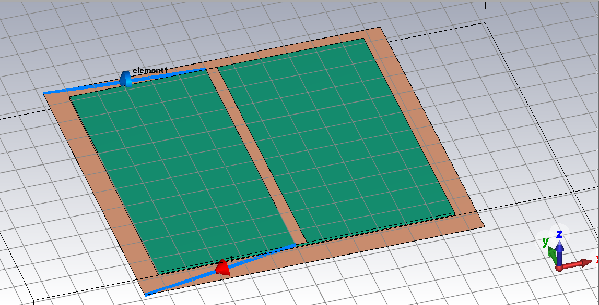
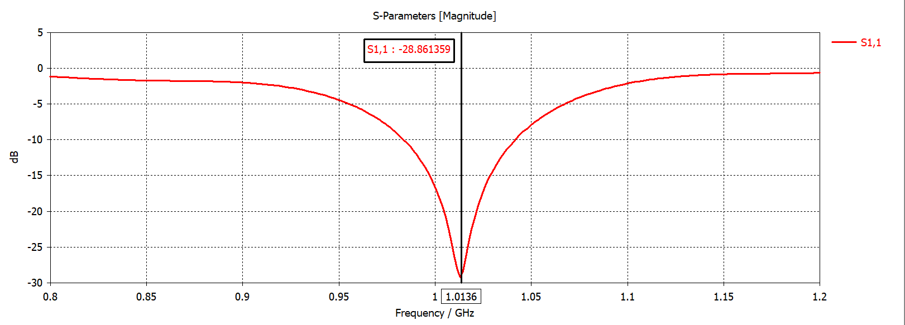
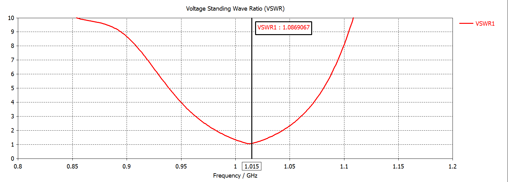
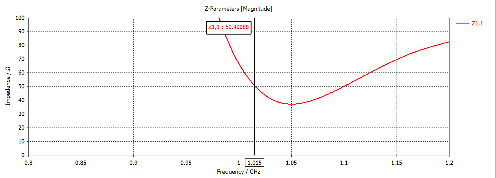

# Моделирование полосковой линии (Microstrip Line / Coupler)

Проект по моделированию и исследованию характеристик полосковой линии в среде **CST Studio Suite**.

---

## 3D Модель

Ниже представлена геометрия исследуемой полосковой линии:

---

## Результаты моделирования

Моделирование проводилось в диапазоне частот **0.8 – 1.2 ГГц**. Рабочая частота согласования составила **1.015 ГГц**.

### Основные характеристики на частоте 1.015 ГГц:

| Параметр | Описание | Значение |
| :--- | :--- | :---: |
| **$S_{1,1}$** | Коэффициент отражения | **-28.86 dB** |
| **VSWR** | Коэффициент стоячей волны по напряжению (КСВН) | **1.086** |
| **$Z_{1,1}$** | Входной импеданс | **50.49 Ом** |

---

### Графики характеристик

  
<b>1. S-параметры ($S_{1,1}$) — Нажмите, чтобы развернуть</b>

   
  

  
<b>2. График КСВН (VSWR) — Нажмите, чтобы развернуть</b>

   
  

  
<b>3. Входной импеданс ($Z_{1,1}$) — Нажмите, чтобы развернуть</b>

   
  

---

## Содержимое репозитория

* `/MicroStrip` — скриншоты 3D модели и графиков характеристик.
* `/*.cst` — исходные файлы проекта CST Studio Suite.

---
